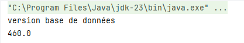
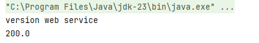

# TP1_Dependency Injection 
**This project demonstrates dependency injection using different methods in Java:**
1. Static instantiation
2. Dynamic instantiation
3. Using the Spring Framework:  
 3.1. XML   
 3.2. Annotations
 ## Project Structure
 
 ## 1. IDao Interface
 Defines the method:
 ```java
package dao;
public interface IDao {
    double getDate();
}
```
## 2. DaoImpl Class
Implements the IDao interface:
```java
@Component("dao")
public class DaoImpl implements IDao{
    @Override
    public double getDate() {
        double temp=23;
        System.out.println("version base de données");
        return temp;
    }
```
## 3. IMetier Interface
Defines the method:
```java
public interface IMetier {
    double calcul();
}
```
## 4. MetierImpl Class
Implements the IMetier interface using weak coupling:
```java
@Component("met")
//@Service("met")
public class MetierImpl implements IMetier{
    //@Autowired
    private IDao dao ;
    public MetierImpl( @Qualifier("dao2")  IDao dao) {
        this.dao = dao;
    }
    //public MetierImpl() {}
    @Override
    public double calcul() {
        double x=20;
        double t=dao.getDate();
        double res=t*x;
        return res;
    }
    public void setDao(IDao iDao){
        this.dao=iDao;
    }}
   ```
## Dependency Injection Methods
A. Static Instantiation
```java
public class prestV1 {
    //l'injection des dépendances  Par instanciation statique
    public static void main(String[] args) {
        DaoImpl d=new DaoImpl();
        MetierImpl metier=new MetierImpl(d);
        //metier.setDao(d);
        System.out.println(metier.calcul());
    }
```
 B. Dynamic Instantiation
```java
public class prestV2 {
    public static void main(String[] args) {
        //instanciation dynamique
        try {
            Scanner sc=new Scanner(new File("config.txt"));
            String daocla=sc.nextLine();
            Class cdao=Class.forName(daocla);
            IDao od=(IDao) cdao.getConstructor().newInstance();
            String mt=sc.nextLine();
            Class cmt=Class.forName(mt);
            IMetier m=(IMetier) cmt.getConstructor(IDao.class).newInstance(od);
            System.out.println(m.calcul());
        } catch (Exception e) {
            System.out.println(e.getMessage());
        }
    }
}
```
C. Using Spring Framework
Version XML
```xml
<!-- config.xml -->
 <bean id="d" class="ext.DaoImplV2"></bean>
    <bean id="metier" class="metier.MetierImpl">
        <!-- <property name="dao" ref="d"></property> -->
         <constructor-arg ref="d"></constructor-arg>
    </bean>
```
```java
//classe prstV3
public class prestV3 {
    public static void main(String[] args) {
//En utilisant le Framework Spring Version
        ApplicationContext context=new ClassPathXmlApplicationContext("config.xml");
        IMetier metier=(IMetier) context.getBean("metier");
        System.out.println(metier.calcul());
    }
```
Version Annotations
```java
public class prestV4 {
    public static void main(String[] args) {
        ApplicationContext context=new AnnotationConfigApplicationContext("dao","metier","ext");
        IMetier metier=context.getBean(IMetier.class);
        System.out.println(metier.calcul());
    }
}
```
## Example Run
**version 1 :database version :**     
  
**version 2 :web service version :**    

